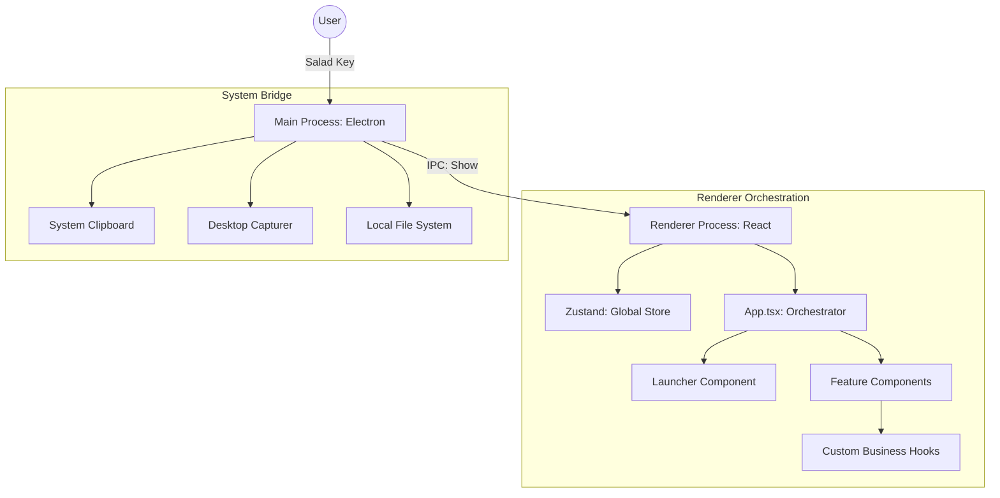

# Salad 🥗

**The Professional Productivity OS.**

Salad is a high-fidelity, local-first suite of tools designed for deep work, asset management, and cognitive flow. No clutter, no clouds—just pure professional utility.

[](LICENSE)
[](package.json)
[](tailwind.config.js)
[](#-target-platforms)

---

## 🛠 Pro Toolset

Every tool in Salad is designed for surgical efficiency and "Happy Flows" (one-click actions).

| Tool | Capability | Professional Utility |
| :--- | :--- | :--- |
| **📋 Clipboard** | Persistent History | optimized sync engine for text, images, and video paths. |
| **📸 Screenshot** | Precision Capture | Pixel-perfect with magnifier, annotations, and manual scrolling. |
| **🎥 Recorder** | One-Click Capture | Minimal pill-mode interface with high-quality WebM export. |
| **📦 Bounding Box** | Reference Guides | Interactive "clickable hole" for TikTok, IG, and YouTube presets. |
| **📝 Quick Note** | Markdown Scratchpad | Instant auto-save to `.txt` files directly on your Desktop. |
| **⌨️ TypeShift** | Cognitive Reflex | Fully gamified typing optimizer with particle and combo systems. |
| **⏱️ Focus Timer** | Deep Work | Integrated Pomodoro (25/5 rhythm) with session tracking. |
| **🧠 Mind Map** | Visual Ideation | Keyboard-driven trees with auto-layout and branch navigation. |
| **🧘 Sanctuary** | Nervous Regulation | Clinical breathing techniques and meditative `useTasbeeh`. |
| **🖱️ Inspector** | Screen Extraction | Real-time coordinate and color (HEX/RGB) data extraction. |

---

## ⌨️ Master the Sanctuary

The **Salad Key** is your gateway to the sanctuary. Mastering these shortcuts makes you a power user.

### Global Trigger
- **Mac:** <kbd>Cmd</kbd> + <kbd>Shift</kbd> + <kbd>G</kbd>
- **Windows/Linux:** <kbd>Ctrl</kbd> + <kbd>Shift</kbd> + <kbd>G</kbd>

### Navigation & Activation
- <kbd>↑</kbd> <kbd>↓</kbd> <kbd>←</kbd> <kbd>→</kbd> : Navigate tools in the strip.
- <kbd>1</kbd> - <kbd>9</kbd> / <kbd>A</kbd> - <kbd>Z</kbd> : Instant tool activation.
- <kbd>Enter</kbd> : Open selected tool / Paste from Clipboard.
- <kbd>Esc</kbd> : Return to launcher / Exit tool.
- <kbd>Cmd</kbd> + <kbd>,</kbd> : Open Settings.

### ⚠️ macOS Permissions
To provide a seamless overlay experience, Salad requires:
1. **Screen Recording:** Essential for Screenshot and Recorder tools.
2. **Accessibility:** Recommended for reliable shortcuts and automatic pasting.

---

## 🏗 Internals & Architecture

Salad is built as a high-performance desktop overlay platform using an **Orchestrator Pattern**.

### Tech Stack
- **Runtime:** Electron (Main process for OS integration)
- **Frontend:** React + TypeScript
- **State:** Zustand (Centralized application store)
- **Styling:** Tailwind CSS ("Liquid Glass" theme)
- **Build:** Vite (Port 5050)

### 📊 System Orchestration


### 🧠 Core Design Decisions
- **The "Hole" Strategy:** Uses `win.setIgnoreMouseEvents` to allow interaction with apps behind transparent overlays.
- **The "Strip & Store":** A minimalist floating bar (**600x80**) that expands into a full Dashboard for management.
- **IPC Overflow Protection:** Thumbnail-first sync for clipboard assets to prevent `write EIO` crashes.
- **Privacy First:** Strict **"No Browser"** policy. No `<webview>`, no `<iframe>`, and zero telemetry.
- **Local Sovereignty:** All data, settings (`settings.json`), and notes remain strictly on your machine.

---

## 🌍 Community Hub

Discover and install community-crafted tools at [salad.hammaadworks.com/tools](https://salad.hammaadworks.com/tools) or via the **Community** tab in the app.

- **Frictionless:** Browsing and usage require no sign-in.
- **Social Auth:** Optional **Google** or **GitHub** sign-on for syncing or publishing.
- **Integrity:** **"One Email, One Provider"** policy to ensure authorship consistency.

---

## 🤝 Contributing: Build Your Sanctuary

Salad is an open-source sanctuary. We welcome surgical, high-fidelity contributions.

### 📐 The `SaladTool` Interface
Every tool is a React component that conforms to:
```tsx
interface SaladToolProps {
  onClose: () => void; // Standard exit signal
}
```

### 🚀 Development Workflow
1. **Scaffold:** Create your component in `src/tools/user/` with `backdrop-blur-3xl`.
2. **Logic:** Encapsulate business logic in custom hooks for testability.
3. **Register:** Add your tool to `src/registry.ts`.
4. **Test:** Verify behavior with **Vitest** (Mandatory for community tools).

---

## 🧪 Quality & Validation

Salad uses **Vitest** and **React Testing Library** for a comprehensive verification suite.

```bash
npm install           # Set up environment
npm run dev           # Start development (Port 5050)
npm run test          # Run the verification suite
npm run build         # Package for production
```

### Coverage Highlights
| Feature | Key Verifications |
|---------|-------------------|
| **Screenshot** | Fullscreen activation, selection logic, manual scrolling entry. |
| **Recorder** | Media stream initialization, "Pill Mode" management. |
| **UX Integrity** | Keyboard-first navigation and Escape-to-exit consistency. |

---

## 🚀 Roadmap

- [x] **v1.0.0 Sanctuary Release:** Modular architecture and TypeShift overhaul.
- [ ] **Salad AI (v1.1.0):**
    - **Local Intelligence:** Integration of local LLMs (Ollama/WebLLM) for zero-cloud privacy.
    - **Smart Summarization:** One-click summarization of Clipboard history and Quick Notes.
    - **Mind Map Gen:** Transform simple text prompts or meeting notes into structured visual Mind Maps.
    - **Semantic Search:** Deep search across all local assets (Screenshots, Notes, Clips) using vector embeddings.
- [ ] **Mobile Companion:** Salad Mini for on-the-go productivity sync.
- [ ] **Audio Routing:** Advanced system audio selection in the Screen Recorder.
- [ ] **Cloud Sync:** End-to-end encrypted opt-in data synchronization.

---

## ❓ Troubleshooting

- **Shortcut Issues:** Check if another app (Alfred/Raycast) conflicts with `Cmd+Shift+G`.
- **Blank Captures:** Ensure "Screen Recording" permissions are active in System Settings.
- **App Missing:** Salad lives in your System Tray. Click the icon to summon or quit.

---

*Salad is built with ❤️ for local-first productivity. 100% Private. 100% Yours.*
